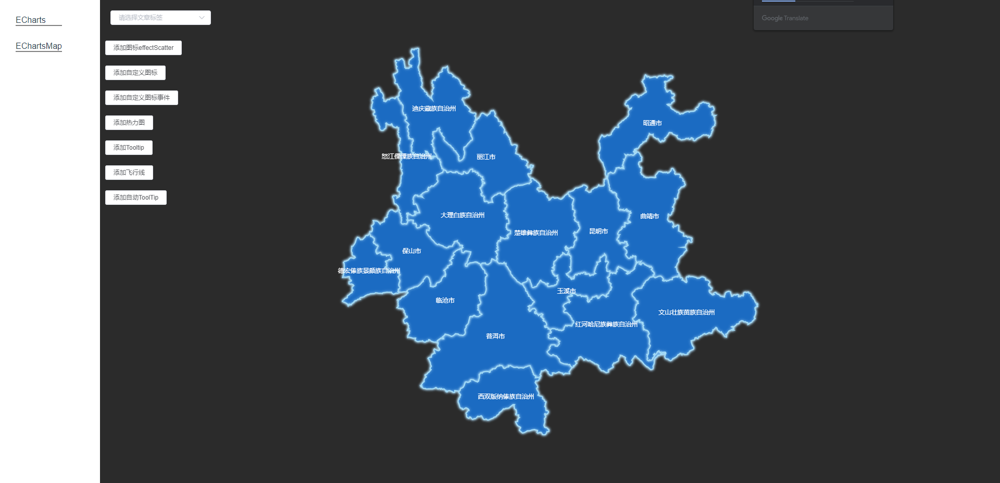
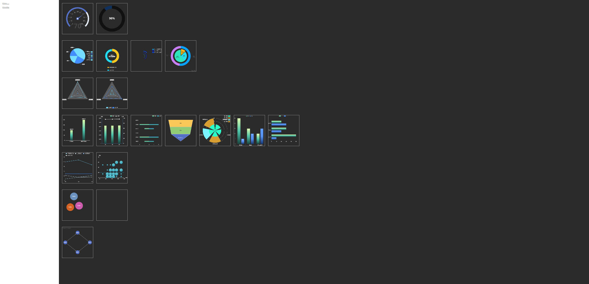
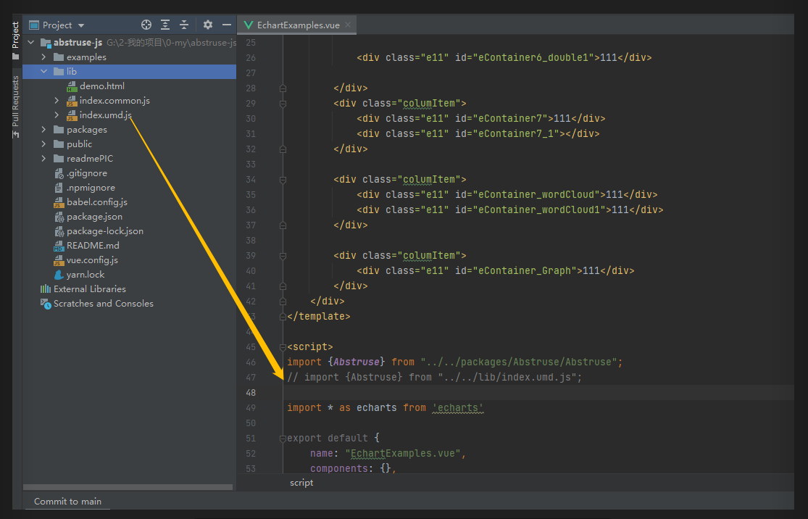
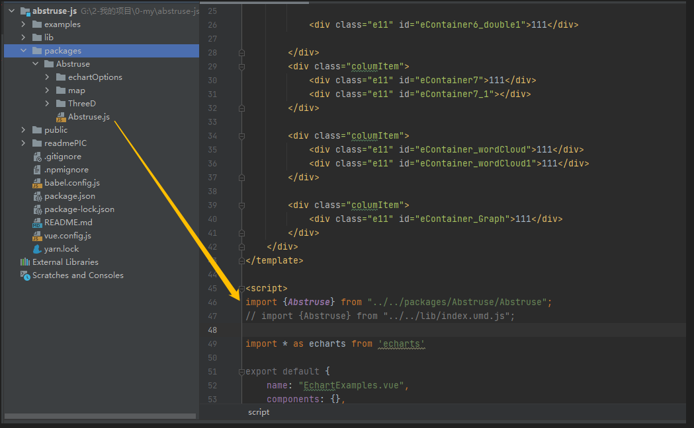

node 版本 v14.15.1

# 工作总结

## 功能预览:

### 1.封装echart组件库



## 

### 引用方式1:直接引用




### 引用方式2:间接引用



## 参考博客地址:

```
https://segmentfault.com/a/1190000039748000
```


## 切换js打包命令

```
"lib": "vue-cli-service build --target lib --name index --dest lib packages/index1.js"
```


## 项目访问地址:

```
https://balconyfarmer.github.io/abstruse-js/dist/index.html
```

